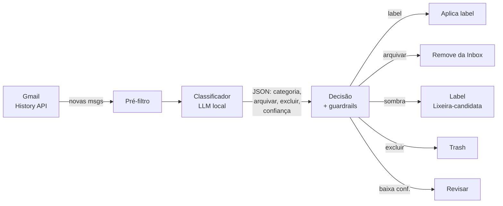

# Polaris

Triagem automática de Gmail com um LLM **local** (ou qualquer endpoint
OpenAI-compatible). O Polaris sincroniza sua caixa de entrada, classifica cada
email em categorias que **você** define, aplica labels, arquiva o que já foi
resolvido e — em modo sombra — marca o lixo promocional como candidato à
Lixeira, para você auditar antes de excluir de verdade.

Projetado para rodar barato: o trabalho pesado (classificação) vai para um
modelo que você já tem em casa, sem custo de API. É um container **run-once**,
agendado por um timer do host.

> ⚠️ **Projeto pessoal, sem garantias.** Ele lê e modifica a sua conta Gmail
> (labels, arquivamento, Lixeira). Rode sempre em `--dry-run` primeiro e
> mantenha o **modo sombra** ligado por semanas antes de confiar na exclusão.
> Nunca faz exclusão permanente — tudo vai para a Lixeira (recuperável ~30 dias).

---

## Como funciona



O escopo OAuth é **`gmail.modify`** apenas: ler, aplicar labels, arquivar e
mandar para a Lixeira. **Nunca** envia email nem apaga permanentemente.

### Decisão (limiares + guardrails)

A ação vem da classificação do modelo, mas **filtrada por regras
determinísticas** — o modelo nunca decide sozinho excluir algo:

| Ação | Condições |
|------|-----------|
| **Revisar** | confiança `< 0.70`, ou JSON inválido → só recebe label `Revisar`, nada é mexido |
| **Label** | confiança `≥ 0.70` → aplica a label da categoria |
| **Arquivar** | `arquivar=true` + conf `≥ 0.80` + thread de mensagem única + categoria **não** protegida (`arquivar_permitido`) |
| **Sombra / Excluir** | `excluir=true` + conf `≥ 0.95` + categoria **elegível** (`permitir_exclusao`) + **`List-Unsubscribe` presente** + thread única |

- **Exclusão sempre começa em modo sombra**: em vez de mandar para a Lixeira,
  aplica a label `Polaris/Lixeira-candidata`. Você audita e só então desliga o
  modo sombra (`MODO_SOMBRA_EXCLUSAO=false`).
- Só categorias com `permitir_exclusao: true` (ex.: `Promoções`) chegam perto da
  exclusão. Categorias sensíveis (ex.: `Segurança`) podem ter
  `arquivar_permitido: false` para **nunca** sair da inbox automaticamente.
- Idempotência: cada email processado recebe `Polaris/Processado`; execuções
  seguintes o pulam.

---

## Pré-requisitos

- **Python 3.12+** (com `venv`/`pip`) para o 1º login OAuth fora do container.
- **Docker + Docker Compose** para rodar a triagem.
- Um **endpoint LLM OpenAI-compatible** acessível (veja abaixo).
- Uma conta **Google Cloud** para gerar as credenciais OAuth (grátis).

### Funciona com qualquer endpoint OpenAI-compatible

O Polaris nunca menciona um provedor específico — tudo vem de variáveis de
ambiente. Serve LM Studio, Ollama, llama.cpp, vLLM, OpenRouter, OpenAI, etc.:

```bash
# Modelo em OUTRA máquina da LAN:
LLM_BASE_URL=http://192.168.0.50:1234/v1
# Mesma máquina do container (o compose já mapeia host.docker.internal):
LLM_BASE_URL=http://host.docker.internal:1234/v1
# Fora do Docker, modelo no mesmo host:
LLM_BASE_URL=http://localhost:1234/v1
```

Se o endpoint estiver fora do ar, o Polaris **pula a execução** (exit 0) — o
modo incremental recupera na próxima rodada. Nada quebra.

---

## Quickstart (~10 min)

```bash
# 1. Clonar
git clone https://github.com/Rhaiderr/polaris.git && cd polaris

# 2. Configurar o endpoint do modelo
cp .env.example .env
$EDITOR .env            # ajuste LLM_BASE_URL e LLM_MODEL

# 3. Definir suas categorias (labels reais do Gmail)
cp config/categorias.yaml.example config/categorias.yaml
$EDITOR config/categorias.yaml

# 4. Credenciais OAuth (uma vez) — veja docs/gerar-credenciais-gmail.md
#    Baixe o credentials.json (OAuth Desktop) para config/ e faça o login:
python -m venv .venv && source .venv/bin/activate
pip install -r requirements.txt
python -m src.orquestrador --login       # gera config/token.json

# 5. Ver a triagem SEM aplicar nada
python -m src.orquestrador --modo completo --dry-run --max 30
```

Confira as linhas `[DRY]` — cada uma mostra a categoria, a confiança e a ação
que o Polaris *tomaria*. Nada é aplicado em `--dry-run`.

> **Login OAuth em máquina headless / via SSH:** o `--login` sobe um servidor
> local na porta `OAUTH_PORT` (default 8765) e imprime a URL sem abrir
> navegador. Faça um túnel — `ssh -L 8765:localhost:8765 seu-host` — e abra a
> URL no navegador da sua máquina. Detalhes em
> [`docs/gerar-credenciais-gmail.md`](docs/gerar-credenciais-gmail.md).

---

## Uso

### CLI

```bash
python -m src.orquestrador [opções]
  --modo {incremental,completo}   incremental (padrão) usa a History API;
                                  completo varre o backlog inteiro
  --dry-run                       não aplica nada; só mostra o que faria
  --reprocessar                   reprocessa mensagens já marcadas Processado
  --max N                         limita quantas mensagens processar
  --login                         faz o 1º login OAuth e sai
```

Na 1ª execução incremental, o Polaris só **fixa o cursor** (bootstrap) e não
processa nada. Use `--modo completo` para o backlog existente.

### Docker (recomendado para o dia a dia)

```bash
docker compose build
docker compose run --rm polaris --modo incremental --dry-run   # teste
docker compose run --rm polaris --modo incremental             # pra valer
```

O `docker-compose.yml` monta `config/` e `logs/` como volumes (nada sensível
entra na imagem) e carrega o `.env` via `env_file`.

### Agendamento (systemd timer no host)

O Polaris é run-once; o agendamento fica no host, não no container. Copie os
exemplos, **ajuste os caminhos e o horário**, e habilite:

```bash
cp systemd/polaris.service.example ~/.config/systemd/user/polaris.service
cp systemd/polaris.timer.example   ~/.config/systemd/user/polaris.timer
$EDITOR ~/.config/systemd/user/polaris.*   # caminhos + OnCalendar
systemctl --user daemon-reload
systemctl --user enable --now polaris.timer
```

Se o seu modelo **não** fica sempre ligado, o `.service` tem hooks opcionais
(`ExecStartPre`/`ExecStopPost`) para acordar/desligar o modelo em volta da
execução — aponte para o seu próprio script (o Polaris não embute isso).

---

## Auditoria e reversão

- **Log de decisões:** cada execução real acrescenta uma linha JSON em
  `logs/decisoes.jsonl` (remetente, assunto, categoria, confiança, ação,
  motivo). É a fonte de verdade para ajustar categorias/limiares com evidência.
  Retenção configurável (`LOG_RETENCAO_DIAS`, default 90).
- **Reverter arquivamento:** os emails continuam no Gmail, só saíram da inbox —
  busque pela label da categoria.
- **Reverter exclusão:** tudo vai para a **Lixeira** (recuperável ~30 dias),
  nunca apagado. No modo sombra, sequer isso: é só a label
  `Polaris/Lixeira-candidata`, que você remove quando quiser.

---

## Configuração (`.env`)

| Variável | Default | Descrição |
|----------|---------|-----------|
| `LLM_BASE_URL` | — | Endpoint OpenAI-compatible (com `/v1`). **Obrigatório.** |
| `LLM_MODEL` | — | Nome do modelo como o endpoint o expõe. **Obrigatório.** |
| `LLM_API_KEY` | vazio | Chave (vazio para endpoints locais). |
| `LLM_TEMPERATURE` | `0.0` | Temperatura da classificação. |
| `LLM_MAX_TOKENS` | `400` | Teto de tokens da resposta. |
| `LLM_TIMEOUT` | `120` | Timeout (s) por chamada. |
| `MODO_SOMBRA_EXCLUSAO` | `true` | Exclusão vira apenas label `Lixeira-candidata`. Mantenha `true`. |
| `EXCLUSAO_PERMANENTE` | `false` | Reservado; o código ignora — exclusão é sempre Lixeira. |
| `LOG_RETENCAO_DIAS` | `90` | Retenção do `decisoes.jsonl`. |
| `OAUTH_PORT` | `8765` | Porta do servidor de login OAuth. |

As **categorias** ficam em `config/categorias.yaml` (gitignored — nomes de
labels são dado pessoal). Cada categoria tem `nome`, `descricao` (orienta o
modelo) e as flags `permitir_exclusao` / `arquivar_permitido`. Trocar
categorias **não** exige mexer em Python.

---

## Troubleshooting

| Sintoma | Causa provável |
|---------|----------------|
| `Endpoint LLM indisponível. Pulando.` | O modelo/endpoint não respondeu. O Polaris pula (exit 0); rode de novo com o modelo no ar. |
| Container não alcança o modelo em `localhost` | Dentro do container, `localhost` é o próprio container. Use `host.docker.internal` (modelo no host) ou o IP da LAN. |
| `Sem token OAuth válido` | Faltou `--login` ou o `config/token.json` não está no lugar. |
| Login OK mas para em ~7 dias | App OAuth ficou em *Testing*. Publique **"In production"** (o refresh token deixa de expirar). Veja o tutorial. |
| `credentials.json não encontrado` | O JSON baixado não foi salvo em `config/credentials.json`. |

---

## Segurança e privacidade

- Escopo mínimo `gmail.modify`; nunca `send` nem `delete` permanente.
- Nada sensível é versionado: `credentials.json`, `token.json`, `.env`,
  `config/categorias.yaml`, `config/state.json` e `logs/` são gitignored.
  O repositório traz apenas os `.example` genéricos.
- O corpo do email é tratado como **entrada não confiável**: o classificador
  delimita o conteúdo e instrui o modelo a ignorar comandos vindos de dentro
  dele (defesa contra prompt injection), com guardrails determinísticos como
  rede de segurança.

---

## Licença

[MIT](LICENSE) © 2026 Leonardo Arouck.
