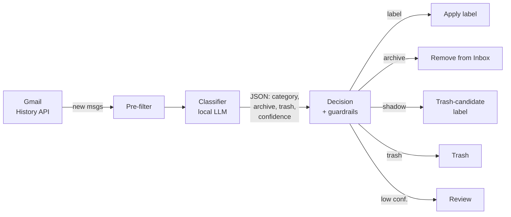

# Polaris

> 🇧🇷 [Versão em português](README.pt-BR.md)

Automatic Gmail triage with a **local** LLM (or any OpenAI-compatible
endpoint). Polaris syncs your inbox, classifies each email into categories
**you** define, applies labels, archives what is already resolved and — in
shadow mode — flags disposable promo email as a Trash candidate, so you can
audit before anything is actually trashed.

Designed to run cheap: the heavy lifting (classification) goes to a model you
already run at home, with zero API cost. Available as a **native Home
Assistant integration** (via HACS) or as a standalone run-once container.

> ⚠️ **Personal project, no warranties.** It reads and modifies your Gmail
> account (labels, archiving, Trash). Always start with a dry run and keep
> **shadow mode** on for weeks before trusting automatic trashing.
> It never deletes permanently — everything goes to the Trash
> (recoverable for ~30 days).

---

## How it works



The OAuth scope is **`gmail.modify`** only: read, apply labels, archive and
send to Trash. It **never** sends email and **never** deletes permanently.

### Decision (thresholds + guardrails)

The action comes from the model's classification, but **filtered by
deterministic rules** — the model never gets to trash anything on its own:

| Action | Conditions |
|--------|------------|
| **Review** | confidence `< 0.70`, or invalid JSON → only gets the `Revisar` label, nothing else is touched |
| **Label** | confidence `≥ 0.70` → applies the category label |
| **Archive** | `arquivar=true` + conf `≥ 0.80` + single-message thread + category **not** protected (`arquivar_permitido`) |
| **Shadow / Trash** | `excluir=true` + conf `≥ 0.95` + **eligible** category (`permitir_exclusao`) + **`List-Unsubscribe` present** + single-message thread |

- **Trashing always starts in shadow mode**: instead of sending to Trash, it
  applies the `Polaris/Lixeira-candidata` label. You audit, and only then turn
  shadow mode off.
- Only categories with `permitir_exclusao: true` (e.g. promos) ever get close
  to trashing. Sensitive categories (e.g. security) can set
  `arquivar_permitido: false` so they **never** leave the inbox automatically.
- Idempotency: every processed email gets `Polaris/Processado`; later runs
  skip it.

---

## Home Assistant (recommended): native integration via HACS

Polaris runs as a **Home Assistant integration** — native Google sign-in
(no terminal, no URL pasting), multiple accounts, scheduling and services:

1. **HACS → Custom repositories** → add
   `https://github.com/Rhaiderr/polaris` (category *Integration*) → install
   **Polaris** and restart HA.
2. Create the OAuth credential (**Web-type app**, once):
   [docs/gmail-credentials.md](docs/gmail-credentials.md).
3. **Settings → Devices & services → Add integration → Polaris**
   → paste the credential (first time only) → **Sign in with Google** → done.
   Another account? Add the integration again.
4. In the integration **options**: model endpoint, daily schedule, shadow mode.
5. Categories live in `/config/polaris/<email>/categorias.yaml` (seeded with
   an example). Services: `polaris.run_triage` (triage; mode `full` for the
   backlog), `polaris.suggest_categories` / `polaris.accept_categories`
   (AI suggestions), a last-run sensor and the `polaris_run_completed` event
   for automations (e.g. wake your model machine before the scheduled run).

The rest of this README covers the **standalone** usage (CLI/Docker/systemd),
which remains fully supported.

> Note: the LLM prompts are currently written in Portuguese (the language the
> reference deployment was tuned with). Classification works with categories
> in any language; a configurable prompt language is on the roadmap.

---

## Standalone prerequisites

- **Python 3.12+** (with `venv`/`pip`) for the first OAuth login outside the
  container.
- **Docker + Docker Compose** to run the triage.
- A reachable **OpenAI-compatible LLM endpoint** (see below).
- A **Google Cloud** account to create the OAuth credentials (free).

### Works with any OpenAI-compatible endpoint

Polaris never hardcodes a provider — everything comes from environment
variables. LM Studio, Ollama, llama.cpp, vLLM, OpenRouter, OpenAI, etc.:

```bash
# Model on ANOTHER machine on the LAN:
LLM_BASE_URL=http://192.168.0.50:1234/v1
# Same machine as the container (compose already maps host.docker.internal):
LLM_BASE_URL=http://host.docker.internal:1234/v1
# Outside Docker, model on the same host:
LLM_BASE_URL=http://localhost:1234/v1
```

If the endpoint is down, Polaris **skips the run** (exit 0) — the incremental
mode catches up next time. Nothing breaks.

---

## Quickstart (standalone, ~10 min)

```bash
# 1. Clone and install
git clone https://github.com/Rhaiderr/polaris.git && cd polaris
python -m venv .venv && source .venv/bin/activate && pip install -r requirements.txt

# 2. Configure the model endpoint
cp .env.example .env
$EDITOR .env            # set LLM_BASE_URL and LLM_MODEL

# 3. OAuth credentials (once) — see docs/gmail-credentials.md
#    Download credentials.json (Desktop OAuth) to config/credentials.json

# 4. Add your account (login + initial categories in ONE command)
python -m src.orquestrador --login              # creates the 'principal' account
$EDITOR config/principal/categorias.yaml        # adjust to YOUR Gmail labels

# 5. See the triage WITHOUT applying anything
python -m src.orquestrador --dry-run --modo completo --max 30
```

Check the `[DRY]` lines — each one shows the category, the confidence and the
action Polaris *would* take. Nothing is applied in `--dry-run`.

`--login` does everything at once: creates `config/principal/`, generates the
token, seeds an initial `categorias.yaml` and prints the next step.

> **OAuth login on a headless machine / over SSH:** `--login` starts a local
> server on port `OAUTH_PORT` (default 8765) and prints the URL without
> opening a browser. Tunnel it — `ssh -L 8765:localhost:8765 your-host` — and
> open the URL in your local browser. Details in
> [`docs/gmail-credentials.md`](docs/gmail-credentials.md).

---

## Usage (standalone)

### CLI

```bash
python -m src.orquestrador [options]
  --conta NAME                    which account to process (config/NAME/).
                                  Omitted: ALL configured accounts
  --modo {incremental,completo}   incremental (default) uses the History API;
                                  completo sweeps the whole backlog
  --dry-run                       applies nothing; only shows what it would do
  --reprocessar                   reprocess messages already marked Processed
  --max N                         limit how many messages to process
  --login                         add/re-authenticate an account and exit
  --sugerir-categorias            suggest new categories from the mailbox and exit
  --aceitar NUMS                  accept saved suggestions ('1,3' or 'todas')
```

On the first incremental run, Polaris only **pins the cursor** (bootstrap) and
processes nothing. Use `--modo completo` for the existing backlog.

### AI category suggestions

Not sure where to start with categories? Let the model look at your mailbox
and propose — you only tick what you want:

```bash
python -m src.orquestrador --conta principal --sugerir-categorias --max 200
```

It samples your most recent emails (**sender/subject only**, never the body),
proposes new categories — without repeating the ones you already have — and
shows a numbered list for you to accept (`1,3`, `todos`, or Enter for none).
Accepted ones land in `categorias.yaml` with `permitir_exclusao: false`
(trashing is always your explicit decision) and a `.bak` backup is written
first.

Without an interactive terminal (automation/front-end), suggestions are saved
to `logs/<account>/sugestoes.json`; acceptance comes later:

```bash
python -m src.orquestrador --conta principal --aceitar '1,2'
```

### Multiple accounts

Each account is an independent profile in `config/<account>/` (its own token,
categories and state); `credentials.json` is **shared** (one OAuth app
authorizes several Google accounts). Adding another account is **one
command**:

```bash
python -m src.orquestrador --conta work --login   # opens the login and seeds categories
$EDITOR config/work/categorias.yaml
```

Run one account with `--conta work`, or **all at once** by omitting `--conta`
(the default — perfect for a timer to process each account in sequence).

### Docker (recommended for day-to-day)

```bash
docker compose build
docker compose run --rm polaris --modo incremental --dry-run   # test
docker compose run --rm polaris --modo incremental             # for real
```

`docker-compose.yml` mounts `config/` and `logs/` as volumes (nothing
sensitive enters the image) and loads `.env` via `env_file`.

### Scheduling (systemd timer on the host)

Polaris is run-once; scheduling lives on the host, not in the container. Copy
the examples, **adjust paths and time**, and enable:

```bash
cp systemd/polaris.service.example ~/.config/systemd/user/polaris.service
cp systemd/polaris.timer.example   ~/.config/systemd/user/polaris.timer
$EDITOR ~/.config/systemd/user/polaris.*   # paths + OnCalendar
systemctl --user daemon-reload
systemctl --user enable --now polaris.timer
```

If your model machine is **not** always on, the `.service` has optional hooks
(`ExecStartPre`/`ExecStopPost`) to wake/stop the model around the run — point
them at your own script (Polaris does not embed this).

---

## Audit and reversal

- **Decision log:** every real run appends a JSON line to
  `logs/decisoes.jsonl` (CLI) or `/config/polaris/<email>/decisions.jsonl`
  (HA integration): sender, subject, category, confidence, action, reason.
  It is the source of truth for tuning categories/thresholds with evidence.
  Retention is configurable (`LOG_RETENCAO_DIAS`, default 90).
- **Undo archiving:** the emails are still in Gmail, just out of the inbox —
  search by the category label.
- **Undo trashing:** everything goes to the **Trash** (recoverable ~30 days),
  never deleted. In shadow mode not even that: it is just the
  `Polaris/Lixeira-candidata` label, which you remove whenever you want.

---

## Configuration (`.env`, standalone)

| Variable | Default | Description |
|----------|---------|-------------|
| `LLM_BASE_URL` | — | OpenAI-compatible endpoint (with `/v1`). **Required.** |
| `LLM_MODEL` | — | Model name as the endpoint exposes it. **Required.** |
| `LLM_API_KEY` | empty | Key (empty for local endpoints). |
| `LLM_TEMPERATURE` | `0.0` | Classification temperature. |
| `LLM_MAX_TOKENS` | `400` | Response token cap. |
| `LLM_TIMEOUT` | `120` | Timeout (s) per call. |
| `MODO_SOMBRA_EXCLUSAO` | `true` | Trashing becomes just the candidate label. Keep `true`. |
| `EXCLUSAO_PERMANENTE` | `false` | Reserved; the code ignores it — trashing is always the Trash. |
| `LOG_RETENCAO_DIAS` | `90` | `decisoes.jsonl` retention. |
| `OAUTH_PORT` | `8765` | OAuth login server port. |

**Categories** live in `config/<account>/categorias.yaml` (gitignored — label
names are personal data). Each category has `nome`, `descricao` (guides the
model) and the `permitir_exclusao` / `arquivar_permitido` flags. Changing
categories requires **no** Python changes.

---

## Troubleshooting

| Symptom | Likely cause |
|---------|--------------|
| `LLM endpoint unavailable. Skipping.` | The model/endpoint did not respond. Polaris skips (exit 0); run again with the model up. |
| Container cannot reach the model on `localhost` | Inside the container, `localhost` is the container itself. Use `host.docker.internal` (model on the host) or the LAN IP. |
| `No valid OAuth token` / account without login | That account is missing `--login` (the token lives in `config/<account>/token.json`). |
| Login works but dies in ~7 days | The OAuth app was left in *Testing*. Publish it **"In production"** (the refresh token stops expiring). See the guide. |
| `credentials.json not found` | The downloaded JSON was not saved to `config/credentials.json`. |

---

## Security and privacy

- Minimal `gmail.modify` scope; never `send`, never permanent `delete`.
- Nothing sensitive is versioned: `.gitignore` ignores **everything** under
  `config/` (the shared `credentials.json` and the per-account
  `config/<account>/` folders with `token.json`, `categorias.yaml` and
  `state.json`), plus `.env` and `logs/`. The repository ships only generic
  `.example` files.
- The email body is treated as **untrusted input**: the classifier fences the
  content and instructs the model to ignore commands coming from inside it
  (prompt-injection defense), with deterministic guardrails as the safety
  net.

---

## License

[MIT](LICENSE) © 2026 Leonardo Arouck.
