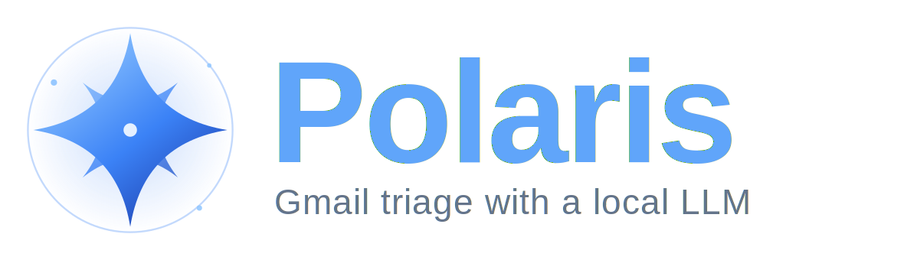
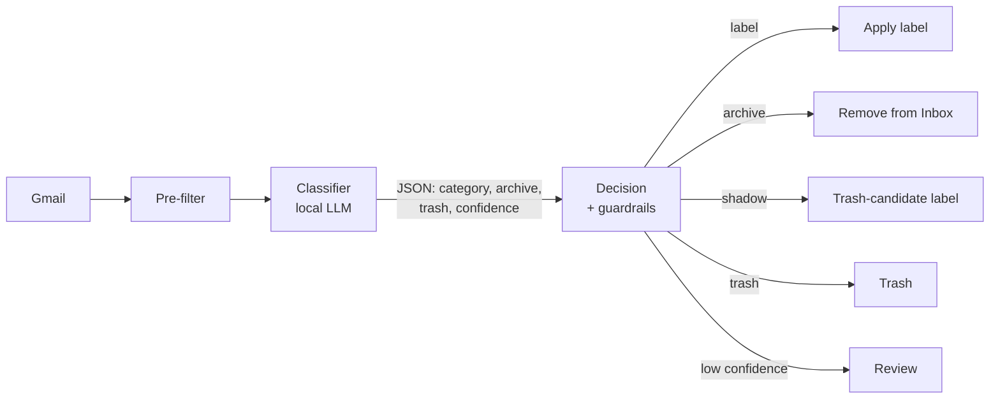

<p align="center">
  
</p>

<p align="center">
  <b>Automatic Gmail triage with a local LLM.</b><br>
  Sorts your inbox into labels <i>you</i> define, archives what's resolved, and flags junk —
  running on a model you already host at home, at zero API cost.
</p>

<p align="center">
  <a href="https://github.com/hacs/integration"></a>
  
  <a href="LICENSE"></a>
</p>

---

Polaris reads each new email, asks a **local** model (or any OpenAI-compatible
endpoint) which of *your* categories it belongs to, and then — filtered by
strict, deterministic safety rules — labels it, archives it, or flags it as
junk. It runs two ways:

- 🏠 **Home Assistant integration (recommended)** — native Google sign-in, a
  device with buttons and sensors, scheduling and HTML reports. *Start here.*
- 📦 **Standalone** — a run-once Python/Docker CLI for servers and cron.

> ⚠️ **It modifies your Gmail** (labels, archiving, Trash). It uses the
> `gmail.modify` scope only: it **never sends email** and **never deletes
> permanently** — everything removable goes to the **Trash** (recoverable
> ~30 days). Keep **shadow mode** on until you trust it. No warranties.

---

## Install — Home Assistant (recommended)

You need three things: **Polaris installed**, a **Google OAuth credential**
(created once), and a reachable **LLM endpoint**.

### 1. Install via HACS

1. HACS → **⋮** → **Custom repositories** → add
   `https://github.com/Rhaiderr/polaris`, category **Integration**.
2. Install **Polaris**, then **restart Home Assistant**.

### 2. Create the Google OAuth credential (once, ~10 min)

Follow **[docs/gmail-credentials.md](docs/gmail-credentials.md)** — create a
**Web application** OAuth app and publish it *In production* (so the login
never expires). You'll paste the Client ID/Secret into Home Assistant once.

### 3. Add your account

**Settings → Devices & services → Add integration → Polaris**:

1. Paste the Client ID/Secret (first time only).
2. **Sign in with Google** and approve the `gmail.modify` access.
3. Done — the account shows up as a device. Add the integration again for
   each extra Gmail account.

### 4. Configure it

Open the integration's **Configure** (options) and set:

| Option | What it does |
|--------|--------------|
| **Model endpoint URL** | Your OpenAI-compatible endpoint, ending in `/v1`. |
| **Model name** | Exactly as the endpoint exposes it. |
| **Run automatically every day** + time | Optional daily schedule. |
| **Maximum emails per run** | Cap per run. **`0` = no limit** (whole backlog). |
| **Shadow mode** | Junk gets a *candidate* label instead of the Trash. Keep **on** for a while. |
| **Use existing Gmail labels as categories** | Let the model classify into any label you already have. |

### 5. Run it from the dashboard

Each account is a **device** with everything you need — no YAML, no Developer
Tools:

- **Run now** button — triages using the mode + simulation toggles below it.
- **Run mode** select — `incremental` (only new mail) or `full` (backlog).
- **Simulation** switch — preview a run without touching Gmail.
- **Run progress** sensor — live 0–100% while a run is in flight.
- **Last run** sensor — timestamp + a summary of what happened.
- **Suggest categories** button (+ a sample-size number) — the model proposes
  new labels from your mailbox; accept them in one click from the report.

Every run writes a styled, interactive **HTML report** ("what went where",
searchable and filterable) linked from the summary notification.

**Categories** live in `/config/polaris/<email>/categorias.yaml` (seeded with
an example — edit it to match your Gmail labels). You can also tune the model's
**prompt** per account in `/config/polaris/<email>/prompt.yaml`.

**Services** (for automations): `polaris.run_triage`,
`polaris.suggest_categories`, `polaris.accept_categories`, plus the
`polaris_run_completed` event (handy to wake your model machine before a
scheduled run).

---

## How it works



The model *suggests*; **deterministic rules decide**. The model can never trash
anything on its own:

| Action | Conditions |
|--------|------------|
| **Review** | confidence `< 0.70` or invalid output → gets the `Revisar` label only |
| **Label** | confidence `≥ 0.70` → applies the category label, stays in the inbox |
| **Archive** | `archive` + conf `≥ 0.80` + single-message thread + category not protected |
| **Trash / Shadow** | `trash` + conf `≥ 0.95` + eligible category + **`List-Unsubscribe` header** + single-message thread |

- **Trashing starts in shadow mode**: instead of the Trash, it applies the
  `Polaris/Lixeira-candidata` label. You audit, then turn shadow mode off.
- Only categories marked `permitir_exclusao: true` (e.g. promos) can ever be
  trashed. Sensitive ones can set `arquivar_permitido: false` to **never** leave
  the inbox automatically.
- **Incremental vs. Full** — *Incremental* processes only new mail (fast, for
  the schedule); *Full* sweeps the backlog **oldest email first**, so repeated
  runs march through the whole mailbox until it's fully reviewed.
- Idempotency: every processed email gets `Polaris/Processado`; later runs
  skip it.

---

## Install — Standalone (Docker / CLI)

Prefer a server or cron instead of Home Assistant? Polaris also runs as a
run-once CLI.

**Requirements:** Python 3.12+, Docker (optional), an OpenAI-compatible LLM
endpoint, and a Google Cloud account for the OAuth credential.

```bash
# 1. Clone and install
git clone https://github.com/Rhaiderr/polaris.git && cd polaris
python -m venv .venv && source .venv/bin/activate && pip install -r requirements.txt

# 2. Configure the model endpoint
cp .env.example .env
$EDITOR .env                 # set LLM_BASE_URL and LLM_MODEL

# 3. OAuth credential (once) — a DESKTOP app, see docs/gmail-credentials.md
#    Save the downloaded file as config/credentials.json

# 4. Add your account (login + seed categories, in one command)
python -m src.orquestrador --login          # creates the 'principal' account
$EDITOR config/principal/categorias.yaml    # adjust to YOUR Gmail labels

# 5. Preview WITHOUT changing anything
python -m src.orquestrador --dry-run --modo completo --max 30
```

The `[DRY]` lines show, per email, the category, confidence and the action
Polaris *would* take. Nothing is applied under `--dry-run`.

> **Headless / over SSH:** `--login` starts a local server on `OAUTH_PORT`
> (default 8765) and prints the URL. Tunnel it —
> `ssh -L 8765:localhost:8765 your-host` — and open the URL locally.

### CLI reference

```
python -m src.orquestrador [options]
  --account NAME                  which account (config/NAME/). Omitted = ALL accounts
  --modo {incremental,completo}   incremental (default, History API) | completo (backlog, oldest first)
  --dry-run                       apply nothing; only print what it would do
  --reprocessar                   reprocess emails already marked Polaris/Processado
  --max N                         cap messages per run (0 = no limit, whole backlog)
  --login                         add / re-authenticate an account, then exit
  --sugerir-categorias            suggest new categories from the mailbox, then exit
  --aceitar NUMS                  accept saved suggestions ('1,3' or 'todas')
```

The first incremental run only **pins the sync cursor** (bootstrap) and
processes nothing — use `--modo completo` for the existing backlog.

### AI category suggestions

Not sure how to split your inbox? Let the model look and propose — you tick
what you want:

```bash
python -m src.orquestrador --account principal --sugerir-categorias --max 200
```

It samples recent emails (**sender/subject only, never the body**), proposes
new categories and shows a numbered list to accept. Accepted ones land in
`categorias.yaml` with `permitir_exclusao: false` (trashing is always your
explicit choice); a `.bak` is written first.

### Docker & scheduling

```bash
docker compose build
docker compose run --rm polaris --modo incremental --dry-run   # test
docker compose run --rm polaris --modo incremental             # for real
```

Polaris is run-once; schedule it on the host. Copy the systemd examples, adjust
paths and time, and enable:

```bash
cp systemd/polaris.service.example ~/.config/systemd/user/polaris.service
cp systemd/polaris.timer.example   ~/.config/systemd/user/polaris.timer
$EDITOR ~/.config/systemd/user/polaris.*   # paths + OnCalendar
systemctl --user daemon-reload && systemctl --user enable --now polaris.timer
```

If your model machine isn't always on, the `.service` has optional
`ExecStartPre`/`ExecStopPost` hooks to wake/stop it around the run.

### Standalone configuration (`.env`)

| Variable | Default | Description |
|----------|---------|-------------|
| `LLM_BASE_URL` | — | OpenAI-compatible endpoint (with `/v1`). **Required.** |
| `LLM_MODEL` | — | Model name as the endpoint exposes it. **Required.** |
| `LLM_API_KEY` | empty | Key (empty for local endpoints). |
| `LLM_TEMPERATURE` | `0.0` | Classification temperature. |
| `LLM_MAX_TOKENS` | `400` | Response token cap. |
| `LLM_TIMEOUT` | `120` | Timeout (s) per call. |
| `MODO_SOMBRA_EXCLUSAO` | `true` | Shadow mode: trashing becomes just the candidate label. Keep `true`. |
| `EXCLUSAO_PERMANENTE` | `false` | Reserved; ignored — trashing is always the Trash. |
| `LOG_RETENCAO_DIAS` | `90` | Decision-log retention. |
| `OAUTH_PORT` | `8765` | OAuth login server port. |

Inside a container, `localhost` is the container itself — use
`host.docker.internal` (model on the host) or the LAN IP for `LLM_BASE_URL`.

---

## Audit & reversal

- **Decision log** — every real run appends a JSON line (sender, subject,
  category, confidence, action, reason) to `logs/decisoes.jsonl` (CLI) or
  `/config/polaris/<email>/decisions.jsonl` (HA). It's the source of truth for
  tuning, and it's pruned to `LOG_RETENCAO_DIAS` days (default 90).
- **Undo archiving** — the email is still in Gmail, just out of the inbox;
  search by its category label.
- **Undo trashing** — everything goes to the **Trash** (recoverable ~30 days),
  never deleted. In shadow mode not even that: just remove the
  `Polaris/Lixeira-candidata` label whenever you want.

---

## Troubleshooting

| Symptom | Likely cause |
|---------|--------------|
| `LLM endpoint unavailable. Skipping.` | The model didn't respond. Polaris skips (exit 0); run again with it up. |
| Container can't reach the model on `localhost` | Use `host.docker.internal` or the LAN IP — `localhost` is the container. |
| Account "not logged in" / `No valid OAuth token` | That account is missing `--login` (CLI) or the HA sign-in. |
| Login works but dies after ~7 days | The OAuth app is still in *Testing*. Publish it **In production** (see the guide). |
| `credentials.json not found` (CLI) | The downloaded file wasn't saved to `config/credentials.json`. |

---

## Security & privacy

- Minimal `gmail.modify` scope — never `send`, never permanent `delete`.
- **Nothing sensitive is versioned:** `.gitignore` excludes everything under
  `config/` (the shared `credentials.json` and the per-account folders with
  `token.json`, `categorias.yaml`, `state.json`), plus `.env` and `logs/`. The
  repo ships only generic `.example` files.
- The email body is treated as **untrusted input**: the classifier fences it
  and instructs the model to ignore any commands inside it (prompt-injection
  defense), with deterministic guardrails as the safety net.

> Note: the LLM prompts ship in Portuguese (the language the reference
> deployment was tuned with). Classification works with categories in any
> language, and in Home Assistant you can rewrite the prompt per account in
> `prompt.yaml`.

---

## License

[MIT](LICENSE) © 2026 Leonardo Arouck.
